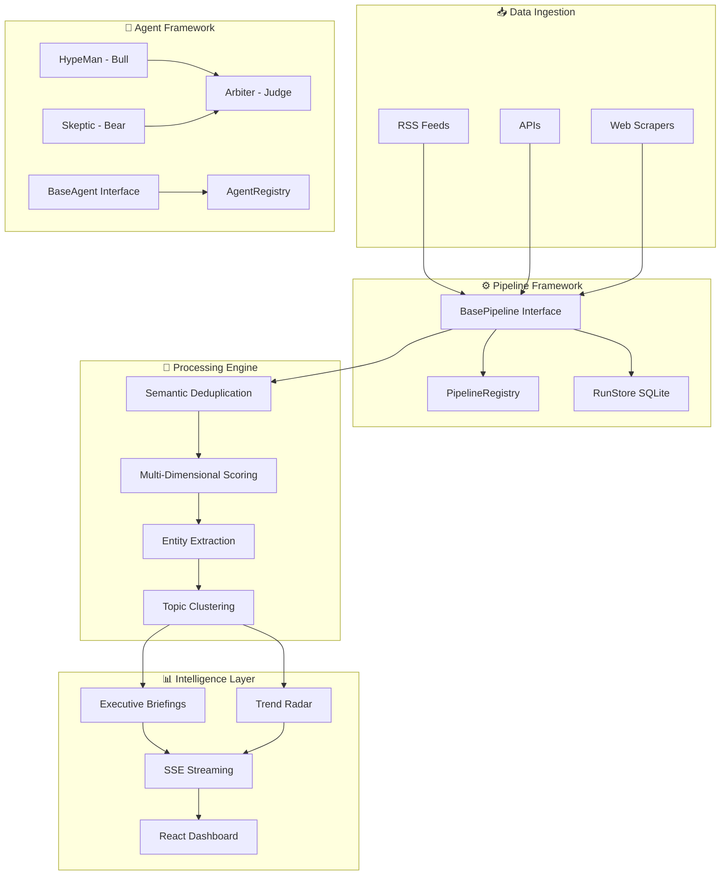

# BriefAI - Multi-Pipeline AI Intelligence Platform

An intelligent multi-pipeline system for AI industry intelligence, featuring automated news briefings, trend radar, investment tracking, Chinese AI ecosystem monitoring, and adversarial analysis agents.

## Overview

**The Problem:** Executives and investors are drowning in AI news. Hundreds of articles daily, most noise.

**BriefAI's Solution:** A signal-to-noise engine that fuses multiple data layers to surface what actually matters:

| Layer | What It Does | Output |
|-------|--------------|--------|
| **News Intelligence** | Scrapes 40+ sources, deduplicates, scores relevance | Daily briefings |
| **Financial Signals** | Tracks stock momentum, funding rounds, CB Rank trends | PMS/MRS scores |
| **Market Sentiment** | Aggregates G2, Capterra, Product Hunt reviews | Consensus NPS |
| **Entity Tracking** | Cross-pipeline company/model mentions | Trend Radar heatmaps |
| **Adversarial Analysis** | Bull vs Bear agent debate, synthesized by Arbiter | Hype-filtered insights |

The result: A single dashboard that answers "What moved in AI today?" in under 60 seconds.

## Architecture


```mermaid
graph TD
    subgraph Input["📥 Data Ingestion"]
        RSS[RSS Feeds]
        API[APIs]
        Scrape[Web Scrapers]
    end

    subgraph Pipeline["⚙️ Pipeline Framework"]
        Base[BasePipeline Interface]
        Registry[PipelineRegistry]
        RunStore[RunStore SQLite]
    end

    subgraph Agents["🤖 Agent Framework"]
        AgentBase[BaseAgent Interface]
        AgentReg[AgentRegistry]
        HypeMan[HypeMan - Bull]
        Skeptic[Skeptic - Bear]
        Arbiter[Arbiter - Judge]
    end

    subgraph Core["🧠 Processing Engine"]
        Dedup[Semantic Deduplication]
        Score[Multi-Dimensional Scoring]
        NER[Entity Extraction]
        Cluster[Topic Clustering]
    end

    subgraph Output["📊 Intelligence Layer"]
        Brief[Executive Briefings]
        Radar[Trend Radar]
        SSE[SSE Streaming]
        Dashboard[React Dashboard]
    end

    RSS --> Base
    API --> Base
    Scrape --> Base
    Base --> Registry
    Base --> Dedup
    Dedup --> Score
    Score --> NER
    NER --> Cluster
    Cluster --> Brief
    Cluster --> Radar
    Brief --> SSE
    Radar --> SSE
    SSE --> Dashboard
    Base --> RunStore
    HypeMan --> Arbiter
    Skeptic --> Arbiter
    AgentBase --> AgentReg
```

## Key Features

### Multi-Pipeline Architecture
| Pipeline | Focus | Sources | Output |
|----------|-------|---------|--------|
| **news** | General AI industry news | TechCrunch, VentureBeat, The Verge, etc. | `ai_briefing_*.md` |
| **product** | AI product launches | Product Hunt, Hacker News, etc. | `product_briefing_*.md` |
| **investing** | VC/funding intelligence | Crunchbase, SEC filings, etc. | `investing_briefing_*.md` |
| **china_ai** | Chinese AI ecosystem | 机器之心, 量子位, 36氪, etc. | `china_ai_briefing_*.md` |

### Pipeline Framework
All pipelines inherit from `BasePipeline`, providing:
- **Streaming events** — Real-time SSE progress updates (`stage_start`, `stage_end`, `item`, `error`, `done`)
- **Run persistence** — Every pipeline run is stored in SQLite with full event history
- **Registry pattern** — Pipelines self-register via `PipelineRegistry` for automatic API discovery

### Agent Framework
Adversarial analysis agents built on `BaseAgent`:
- **HypeMan** 🐂 — Builds the bull case from GitHub stars, HF downloads, paper citations, news volume
- **Skeptic** 🐻 — Challenges with SEC filings, VC portfolios, revenue data, deployment metrics
- **Arbiter** ⚖️ — Synthesizes both sides, only surfaces trends where Skeptic fails to refute
- Each agent exposes an `AgentCard` with capabilities, accepted inputs, and output schema

### Trend Radar
- Cross-pipeline entity tracking
- Historical baseline comparison (4-week rolling)
- Rising/falling signal detection
- Company mention heatmaps

### Data Enrichment
- **Funding data**: Kaggle Crunchbase + ITJuzi + Wikidata SPARQL
- **Product reviews**: G2, Capterra, Product Hunt, App Store ratings
- **Financial signals**: Stock data via yfinance (US) and AKShare (China A-shares)
- **VC portfolios**: OpenBook DoltHub database

### Chinese AI Coverage
- 8 Chinese news sources (RSS + web scraping)
- 6 categories: 国产大模型, AI监管政策, 国产芯片, AI研究, 行业动态, AI投融资
- 25+ Chinese AI companies tracked with funding data
- Original Chinese text (原文) output

## Scoring Methodology

BriefAI uses a multi-signal approach inspired by quantitative finance:

| Signal | Description | Data Sources |
|--------|-------------|--------------|
| **Technical Velocity** | GitHub stars growth, HuggingFace downloads, arXiv citations | GitHub API, HF Hub, Semantic Scholar |
| **Capital Conviction** | Funding rounds, CB Rank trajectory, investor quality | Crunchbase, SEC filings, OpenBook VC |
| **Market Sentiment** | Product reviews weighted by platform authority | G2 (1.0x), Capterra (0.9x), Product Hunt (0.7x) |
| **News Momentum** | Article frequency × source credibility × relevance score | 40+ curated sources |

Each company receives a composite score enabling apples-to-apples comparison across the AI landscape.

## Quick Start

### Option A: Docker (Recommended)
```bash
git clone https://github.com/yourusername/briefAI.git
cd briefAI
cp .env.example .env  # Add your API keys
docker-compose up -d --build
# API: http://localhost:8000 | Dashboard: http://localhost:5173
```

### Option B: Manual Installation

#### 1. Install Dependencies
```bash
git clone https://github.com/yourusername/briefAI.git
cd briefAI
pip install -r requirements.txt
cd frontend && npm install && cd ..
```

#### 2. Configuration
Create `.env` file:
```bash
# LLM Providers
MOONSHOT_API_KEY=your_key_here
OPENROUTER_API_KEY=your_key_here
ANTHROPIC_API_KEY=your_key_here

# Optional
DEFAULT_CATEGORIES=fintech_ai,data_analytics,marketing_ai
REPORT_LANGUAGE=zh-CN
```

#### 3. Run the Application

**Start API + Dashboard:**
```bash
# Terminal 1: API server
python -m api.main
# API available at http://localhost:8000

# Terminal 2: React dashboard
cd frontend && npm run dev
# Dashboard at http://localhost:5173
```

**Run pipelines:**
```bash
# Run all pipelines
python pipeline/orchestrator.py --all

# Run specific pipeline
python pipeline/orchestrator.py --pipeline china_ai --date 2026-01-22

# Run with custom date range
python pipeline/orchestrator.py --pipeline news --start-date 2026-01-15 --end-date 2026-01-22
```

## Project Structure

```
briefAI/
├── api/                            # FastAPI backend
│   ├── main.py                     # API entry point
│   └── routers/
│       ├── briefings.py            # Briefing report endpoints
│       ├── companies.py            # Company data + stock prices
│       ├── trends.py               # Trend radar endpoints
│       ├── alerts.py               # Alert management
│       ├── pipeline_runs.py        # Pipeline SSE streaming endpoints
│       └── agents.py               # Agent discovery and invocation endpoints
├── pipeline/                       # Pipeline orchestration
│   ├── orchestrator.py             # Multi-pipeline runner
│   ├── base.py                     # BasePipeline ABC, PipelineRegistry, event types
│   ├── news_pipeline.py            # Reference pipeline implementation
│   └── run_store.py                # SQLite persistence for pipeline runs
├── agents/                         # Adversarial analysis agents
│   └── base.py                     # BaseAgent ABC, AgentCard, AgentRegistry
├── modules/                        # Core pipeline modules
│   ├── web_scraper.py              # RSS/HTML scraping
│   ├── news_evaluator.py           # Article scoring
│   ├── article_paraphraser.py      # Content summarization
│   ├── report_formatter.py         # Report generation
│   ├── signals_extractor.py        # Risk signal extraction
│   └── cluster_engine.py           # DBSCAN clustering
├── scrapers/                       # Data scrapers
│   ├── cn_ai_funding_lookup.py     # Chinese AI funding scraper
│   ├── cn_funding_importer.py      # Import funding to DB
│   ├── product_review_scraper.py   # G2/Capterra/PH reviews
│   ├── funding_enricher.py         # Kaggle + Wikidata enrichment
│   └── openbook_vc_scraper.py      # VC firm database
├── utils/                          # Shared utilities
│   ├── llm_client.py               # LLM wrapper
│   ├── entity_extractor.py         # spaCy + Claude NER
│   ├── scoring_engine.py           # Weighted scoring
│   ├── signal_store.py             # SQLite signal storage
│   ├── alert_store.py              # Alert persistence
│   └── model_config.py             # Model config manager
├── config/
│   ├── pipelines.json              # Pipeline definitions
│   ├── models.yaml                 # Per-pipeline model configuration
│   ├── sources.json                # News sources (general)
│   ├── sources_china_ai.json       # Chinese AI sources
│   ├── categories.json             # Category taxonomy
│   ├── categories_china_ai.json    # Chinese categories
│   └── report_template*.md         # Report templates
├── data/
│   ├── reports/                    # Generated briefings
│   ├── trend_radar.db              # Company/entity tracking
│   ├── alerts.db                   # Alert storage
│   ├── pipeline_runs.db            # Pipeline run history
│   ├── kaggle/                     # Crunchbase CSV data
│   └── alternative_signals/        # Scraped signals (JSON)
└── docs/
    └── plans/                      # Implementation plans
```

## API Endpoints

### Briefings & Data

| Endpoint | Description |
|----------|-------------|
| `GET /api/briefings/available` | List all available briefings |
| `GET /api/briefings/{pipeline}/{date}` | Get specific briefing |
| `GET /api/companies?market=cn` | List companies (filter by market) |
| `GET /api/companies/{id}/stock` | Get stock price data |
| `GET /api/trends/rising` | Get rising entities |
| `GET /api/alerts` | Get active alerts |

### Pipeline Management

| Endpoint | Description |
|----------|-------------|
| `GET /api/v1/pipelines` | List registered pipelines |
| `POST /api/v1/pipelines/run` | Trigger pipeline with SSE streaming |
| `GET /api/v1/pipelines/runs` | List past pipeline runs |
| `GET /api/v1/pipelines/runs/{id}` | Get run details + events |
| `GET /api/v1/pipelines/stats` | Aggregate run statistics |
| `GET /api/v1/pipelines/active` | Currently running pipelines |

### Agent System

| Endpoint | Description |
|----------|-------------|
| `GET /api/v1/agents` | List agents with capability cards |
| `GET /api/v1/agents/{id}` | Get agent capability card |
| `POST /api/v1/agents/{id}/run` | Invoke agent with input |

## Data Sources

### News Sources (40+)
- **English**: TechCrunch, VentureBeat, The Verge, Wired, MIT Tech Review, etc.
- **Chinese**: 机器之心, 量子位, 36氪, 新智元, 雷锋网, PaperWeekly, 智源社区

### Funding Data
- **Kaggle Crunchbase**: 13,800+ companies with funding rounds
- **ITJuzi**: Chinese startup funding via web search
- **Wikidata SPARQL**: Fallback for public company data

### Alternative Signals
- Product reviews (G2, Capterra, Product Hunt)
- Stock data (yfinance, AKShare for China)
- VC firm databases (OpenBook DoltHub)
- SEC filings

## Chinese AI Companies Tracked

| Category | Companies |
|----------|-----------|
| **LLM** | DeepSeek, Moonshot (Kimi), Zhipu (ChatGLM), Baichuan, MiniMax, 01.AI, Stepfun |
| **Big Tech** | Baidu (文心), Alibaba (通义), Tencent (混元), ByteDance (豆包), Huawei (盘古) |
| **Chips** | Cambricon (寒武纪), Horizon (地平线), Biren (壁仞), Moore Threads, Enflame |
| **Vision** | SenseTime, Megvii (Face++), CloudWalk, Yitu |
| **Enterprise** | iFlytek (讯飞), Fourth Paradigm |
| **Robotics** | Unitree (宇树) |

## Configuration

### `config/pipelines.json`
Defines pipeline configurations:
```json
{
  "pipelines": {
    "china_ai": {
      "name": "中国AI生态",
      "sources_file": "sources_china_ai.json",
      "categories_file": "categories_china_ai.json",
      "output_prefix": "china_ai_briefing",
      "enabled": true
    }
  }
}
```

### `config/sources_china_ai.json`
Chinese AI news sources:
```json
{
  "sources": [
    {
      "id": "jiqizhixin_main",
      "name": "机器之心",
      "type": "rss",
      "rss_url": "https://www.jiqizhixin.com/rss",
      "language": "zh-CN",
      "credibility_score": 9
    }
  ]
}
```

### Model Configuration (`config/models.yaml`)

Per-pipeline and per-task model selection with fallback chains:

```yaml
pipelines:
  news:
    model: haiku           # Fast, cost-effective for daily briefings
  investing:
    model: sonnet           # Higher reasoning for financial analysis
  product:
    model: haiku
  china_ai:
    model: haiku

tasks:
  deep_research:
    model: sonnet           # Complex multi-step reasoning
  entity_extraction:
    model: gemini-flash     # Fast structured extraction
  adversarial_analysis:
    model: sonnet           # Nuanced argumentation
```

- **Pipelines**: news (Haiku), investing (Sonnet), product (Haiku), china_ai (Haiku)
- **Tasks**: deep_research (Sonnet), entity_extraction (Gemini Flash), adversarial_analysis (Sonnet)
- **Override via environment variables**: `BRIEFAI_{PIPELINE}_MODEL` (e.g., `BRIEFAI_NEWS_MODEL=sonnet`)

## Development

### Run Tests
```bash
pytest tests/
```

### Type Checking
```bash
pyright
```

### Add New Pipeline

1. Create a class inheriting from `pipeline.base.BasePipeline`
2. Implement `pipeline_id`, `display_name`, and `async def run(config)`
3. Add source/category configs in `config/`
4. Register in `api/routers/pipeline_runs.py::_register_defaults()`
5. Add model config in `config/models.yaml`

### Add New Agent

1. Create a class with a `card` property returning `AgentCard` and `async def run(input)`
2. Register in `api/routers/agents.py::_register_defaults()`
3. Add model task config in `config/models.yaml` under `tasks:`

## Roadmap

### Completed
- [x] Multi-pipeline architecture (news, product, investing, china_ai)
- [x] Chinese AI ecosystem coverage (25+ companies, 8 sources)
- [x] Funding data enrichment (Kaggle + ITJuzi + Wikidata)
- [x] Product review aggregation (G2, Capterra, Product Hunt, App Store)
- [x] Trend radar with cross-pipeline signals
- [x] React dashboard with company detail views
- [x] CB Rank trend tracking
- [x] China market signals (PMS-CN, MRS-CN) with US/CN market toggle
- [x] Pipeline interface (BasePipeline) with streaming events
- [x] Pipeline run persistence (SQLite run store)
- [x] SSE streaming for live pipeline progress
- [x] Agent interface (BaseAgent) with capability cards
- [x] Agent registry and API endpoints
- [x] Per-pipeline model configuration (YAML)
- [x] Adversarial analysis agents (HypeMan, Skeptic, Arbiter)

### In Progress
- [ ] Real-time alert system

### Agentic Architecture (Next Phase)

#### JIT Context Loading (MCP Integration)
Dynamic tool invocation to reduce context pollution:

- **Trigger-based**: Only deep-dive when thresholds hit (e.g., >500 GitHub stars in 48h)
- **Model Context Protocol**: Agent "pulls" data on-demand vs. dumping everything
- **Benefit**: 70% token reduction, fewer hallucinations

#### Shadow Mode Backtesting
Prove predictions work before trusting them:

```bash
# Retrospective analysis
python backtest.py --date 2025-07-01 --predict-horizon 90d

# Output: "Predicted rise of Cursor IDE 3 months before mainstream coverage"
# Accuracy: 78% on technical momentum signals
```

- Ingest historical data (e.g., Jan 2025)
- Generate predictions for Q3 2025
- Score against actual outcomes
- Tune signal weights based on accuracy

### Future Vision
- [ ] **MCP Integration**: Just-in-time context loading for anomaly deep-dives
- [ ] **Backtesting Engine**: Shadow mode to validate trend predictions
- [ ] **Predictive Alerts**: Early warning system based on signal convergence
- [ ] **IRM Integration**: Connect to Identify-Respond-Monitor lifecycle

## License

This project is provided as-is for demonstration and internal evaluation.

---

**Last Updated**: February 4, 2026 | **Version**: 4.0 (Pipeline & Agent Framework)
